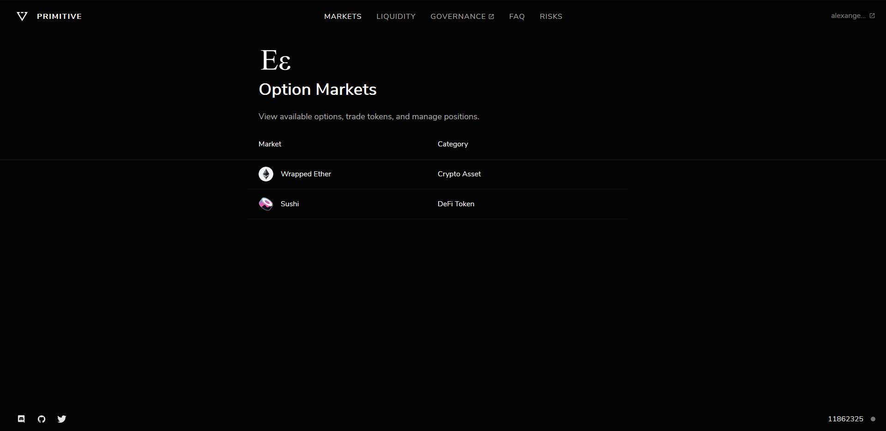
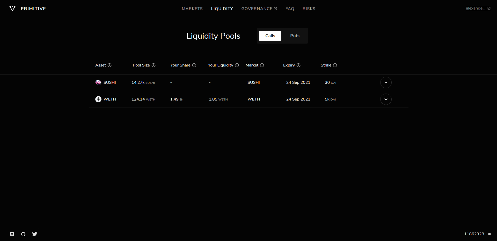
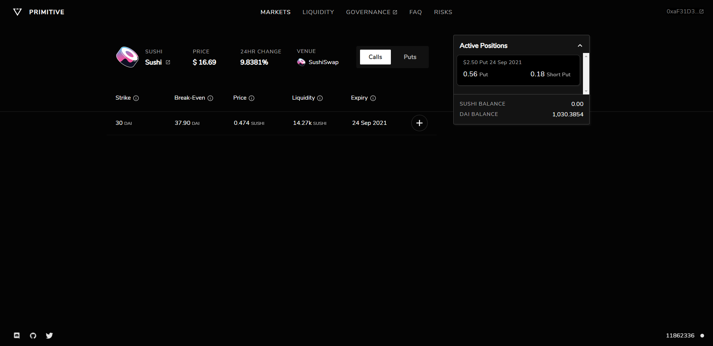
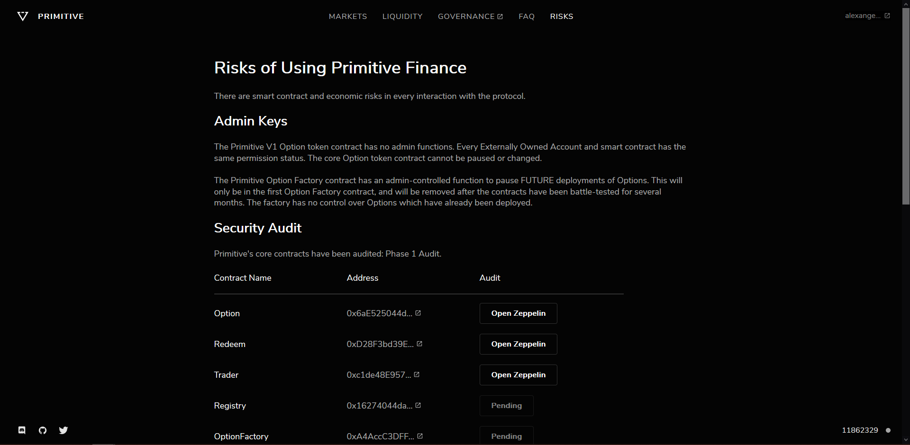

# Interface Overview

### Markets Homepage

The markets homepage is where anyone can view what permissionless markets are available.

### Liquidity View

The liquidity page has a list of all option pools which can have assets added to them.

### Market View

When a market is selected on the homepage, it will transmit to this page. This gives an overview of the available options, the performance of the asset over the past 24hrs, and any active positions held by the connected wallet.

### Risks View

The risks page details all the risks with using the Primitive protocol. It also has links to the latest security audits.

