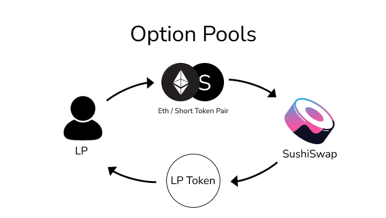
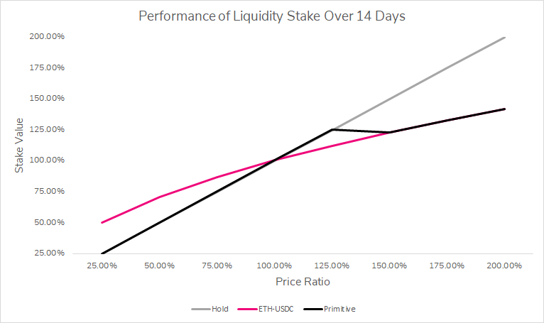
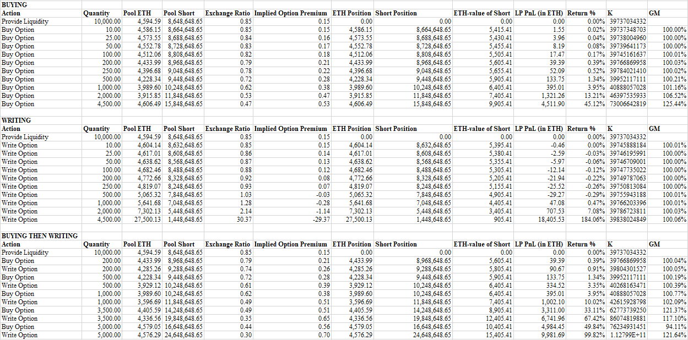

# What are Option Pools?

### Basics

Option pools are a pool with any amount of assets, where at least one of those assets is a derivative of another asset in the pool. Derivative's are valued as a function of the underlying asset value, which introduces new mechanics when they exist as a pair of assets in a pool. Primitive option pools use the **Short Option Token** as the derivative token.

The first pools supported by Primitive are constant product AMMs like Uniswap and Sushiswap. These are two-asset pools which give an equal weight of 50% to each asset.

When assets are provided to the pool, 50% of the total value must be denominated in the underlying token, while the other 50% of total value must be in the derivative token.

**Option pools have new properties**, including:

* Limited Impermanent loss until the strike price of the option is reached.
* 100% Underlying token exposure until the strike price of the option is reached.
* Automatic buying or selling of the strike asset when the strike price is reached \(like a limit order\).

These properties **enable portfolios to take advantage of the strike price** for these option pools to fulfill a need including:

* Allow a treasury to earn **APY on a native token balance sheet**, and sell 50% of the provided liquidity at the strike price \(roll to stablecoins\).
* Allow a portfolio to earn **APY on DAI**, and buy the option's asset \(ETH, BTC, DeFi token\) when the strike price is reached for the Put option pool \(buy low\).
* Bundle option pool liquidity positions to **mitigate most impermanent losses**, while still earning fees from AMM swaps.

### Advanced

Yes, **limited** impermanent loss **until the strike price is hit** and **capped downside** \(in terms of underlying\). The only scenario for LPs to lose 100% of their capital is if the underlying assets go to $0 \(because they are effectively holding the underlying assets\).

If the options go in the money \(their spot price reaches the option's strike price\) the LP's portfolio \(LP tokens\) changes from a HOLD portfolio \(100% Underlying\) to a 50%-50% USD-Underlying portfolio, which will start feeling impermanent losses.

When an LP enters a pool, they also get a hedge against their provided options liquidity. Over time, trades might skew in a direction far enough to make this hedge not cover the full position. In most cases, this hedge will take care of your option risk \(its literally an option\) so that as an LP you remain neutral.

LP returns are estimated to be 15% in the underlying token, which means 15% APY in ETH for the $5,000 ETH call market, and 15% APY in SUSHI for the $30 Sushi call market.

These properties come from the **naturally lower volatility losses of the pair**.

### Trade Examples

