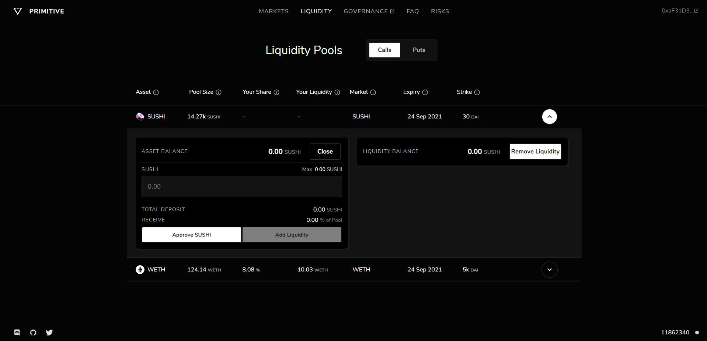

# Managing liquidity positions

### How can I monitor my liquidity position?

On the Primitive interface, the liquidity page will display all the option pools along with a connected wallet's provided liquidity. This total liquidity amount is calculated based on the underlying tokens in the pool, along with the underlying tokens released from closing the short option tokens \(which are the other asset in the pool\).

### How can I add to my liquidity position?

Select the pool to add liquidity to, and choose "Add liquidity". This will show a deposit input which will allow you to add liquidity to the option pool.

### How do I exit my liquidity position?

There are no lock periods for liquidity, therefore, any position can be exited at any time. However, "impermanent exposure" may have accrued to your position. This happens when the ratio of **short option tokens** to **underlying tokens** has increased, when compared to the ratio when a position was first entered. 

When a liquidity position is entered, it receives a proportional amount of **long option tokens,** which act as a hedge against the **short option tokens** in the pool. Since the **short option token ratio** increased, this hedge does not fully cover the accrued short option token "impermanent exposure".

There are three options to exit the position:

* Only exit up to the amount that the **long option token** balance covers \(may not be up to 100%\).
* Purchase **long option tokens** on the market, to 100% exit the position.
* Exit most of the position, and remove the remaining liquidity directly. Hold the "impermanent exposure" amount of short tokens in your wallet.

### How does "impermanent exposure" happen?

Short option token exposure will accrue when more options are bought than are sold in the option pool. Long option token exposure will accrue when more options are sold than are bought in the option pool.

