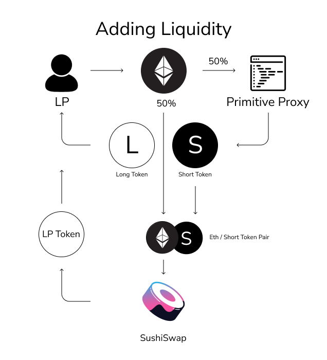

# Providing liquidity

### How is liquidity provided?

To provide liquidity, only a single asset deposit of the underlying token is required. 

### Single-asset Deposit

A portion of the underlying asset is used to mint Primitive Option tokens. The remaining deposit, along with the minted **Short Option Tokens** are provided as liquidity to the pool, which returns **LP tokens**. When option tokens are minted, there is a long and a short option. Since the short option tokens were provided as liquidity to the pool, the long option tokens are returned to the LP's wallet. These long option tokens should be held until the liquidity position is exited, because **they are a hedge against impermanent option exposure.**

### Option Pool Types

For Call option pools, the underlying token is the asset \(this example is for ETH calls, since ETH is the underlying asset being deposited.

For Put option pools, the underlying token is always DAI.

### Option Pool APY

These Option pools earn APY from:

* Swapping fees \(0.30%\)

The risk of impermanent loss is completely mitigated until the strike price of the option is reached. This makes the APY more attractive on a risk-adjusted basis, rather than a raw APY basis.

