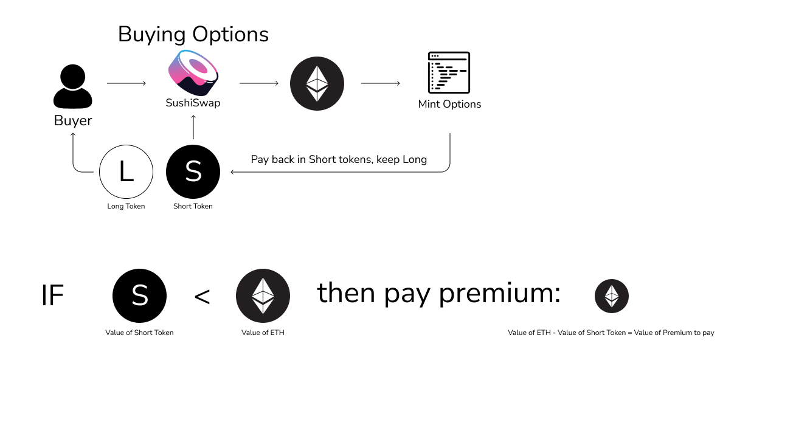

# How are Primitive Options Priced?

Primitive has smart contracts which are a layer above a core Automated Market Maker \(AMM\) pool. The active AMM used by Primitive is SushiSwap, which uses the constant product curve. 

The price of options on Primitive is therefore **determined by the market**, specifically by the ratio of assets in the AMM.

The short option tokens and underlying tokens are the assets in the pool, and the ratio between these assets is effectively **the short option token premium**. 

Therefore, the **long option token premium** is 1 - **shortOptionPremium**.

### Why use an AMM?

That's a good question, using an AMM has explicit tradeoffs, including:

Pros:

* Censorship resistance
* Enables liquidity providers to earn fees on option trading
* Composability with other protocols
* On-chain IV derivations from on-chain premiums

Cons:

* High slippage for large orders

These are trade-offs which will be improved on in the next version of the protocol, V2, which focuses on efficiency of liquidity and reducing slippage for traders.

### How are long option tokens traded without being in the pool?

This is a commonly asked question, and it's a clever mechanic the protocol uses in the background to get this to work:

### LP Tokens

Primitive Pool LP tokens are an instrument themself, and they will be utilized by other traders or liquidity providers for desired exposure. These pools also enable the LPs to get exposure to option trading fees, which is an avenue for yield that isn't widely available in DeFi.

