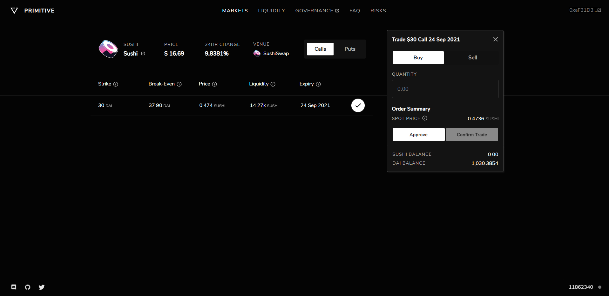

# Swapping to Option Tokens

### How do I buy option tokens?

Buying option tokens is simply swapping the underlying token to the option token, thus the premiums for these options are paid in the underlying token. Keep in mind, Put options have DAI as the underlying token.

1. Approve the [Primitive Connector](https://etherscan.io/address/0x9daec8d56cdcbde72abe65f4a5daf8cc0a5bf2f9) contract to spend your underlying tokens. Warning: this is an infinite approval.
2. Type how many option tokens that you'd like to swap to. Make sure to check the "execution price", slippage is higher for option trades.
3. Confirm the trade and then confirm in your wallet.

### How do I "write" option tokens?

Writing option tokens is a core feature of option trading since it is effectively shorting the option token. The design of Primitive enables short option positions to be purchased directly. To write option tokens, select an option and click on the "Sell" button. This order type is to "Sell to Open", effectively shorting an option token to open a position. **Note: if long option tokens are held, this sell order will sell the long option tokens. There must be a wallet balance of 0 long option tokens to sell to open a position.**

### How are long option tokens purchased, even though they are not in the pool?

This is a commonly asked question, and it's a clever mechanic the protocol uses in the background to get this to work.

